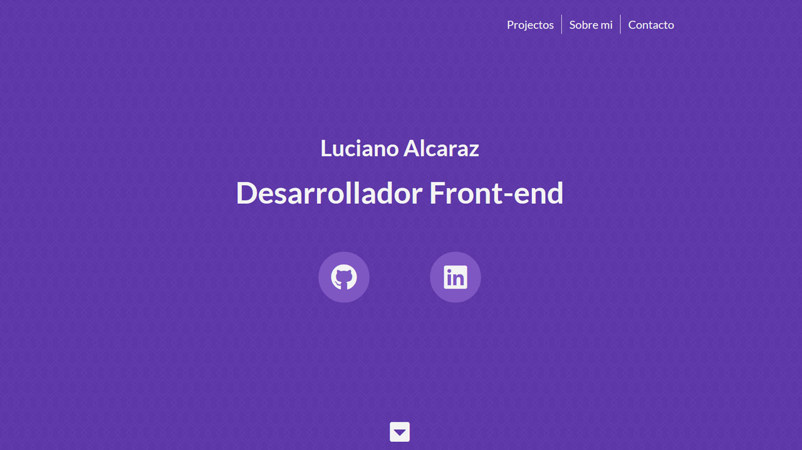

# Portfolio

> My personal portfolio website

## Table of contents

- [General info](#general-info)
- [Screenshots](#screenshot)
- [Technologies](#technologies)
- [Setup](#setup)
- [Status](#status)

## General info

This is my personal portfolio website.

I have been working on it for some time, but I have never uploaded it to the web.

There is a lot of things from this project that I have learned, such as sectioning the content in smaller parts to make it easier to read later and using responsive media queries to make it work on all screens.

Also I struggled a lot with the design, the first version had videos and a lot of unnecessary stuff that I have removed, so this version is much cleaner now.

## Screenshot

## Technologies

- HTML
- CSS
- [AOS](https://michalsnik.github.io/aos/)

## Setup

- [Demo](https://lga-dev.github.io/)

## Status

Project is: _finished_
